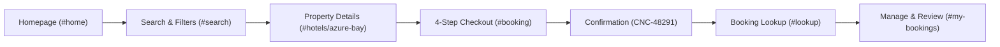
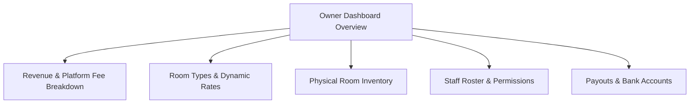
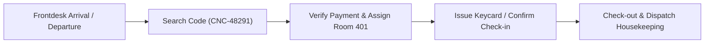
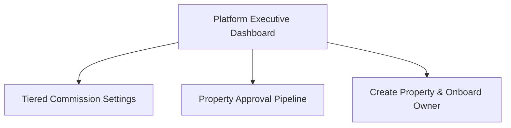

# AirCnC Hotel Booking & Operations Platform — Mockup UI Demonstration

> **Interactive Frontend Prototype** built with pure **HTML5, CSS3, and Vanilla JavaScript** (Zero external runtime dependencies). Designed for customer demonstrations, stakeholder reviews, and seamless engineering handover.

---

## 📌 Executive Summary

**AirCnC** is a modern hospitality platform covering both guest booking journeys and comprehensive hotel operations across multiple roles.

This repository contains a **fully interactive, high-fidelity Mockup UI prototype**. It allows customers, product owners, and development teams to explore end-to-end user journeys, UX behaviors, UI components, and state transitions directly in any web browser without needing a backend server or database setup.

---

## 🚀 Quick Start & Demonstration Setup

### 1. Instant Local Preview
No `npm install`, build steps, or local dependencies are required.

- **Option A (Direct Browser Open):** Double-click `index.html` or open it with Google Chrome, Microsoft Edge, Safari, or Firefox.
- **Option B (VS Code / Antigravity IDE):** Right-click `index.html` and select **"Open with Live Server"**.
- **Option C (Simple Static Server):**
  ```bash
  # Using Python 3:
  python -m http.server 8080
  # Then open http://localhost:8080 in your browser
  ```

### 2. Live Hosting (GitHub Pages / Vercel)
This repository is ready to deploy directly to GitHub Pages or static hosts:
1. Push this repository to GitHub.
2. Navigate to repository **Settings** > **Pages**.
3. Under **Build and deployment**, set **Source** to `Deploy from a branch`, choose branch `main`, and folder `/ (root)`.
4. Click **Save**. Within 30–60 seconds, your live demo link will be generated:
   ```
   https://<username-or-org>.github.io/<repo-name>/
   ```

---

## 🧭 Live Demonstration Guide: Core Flows

To facilitate customer presentations and stakeholder walkthroughs, a sticky **Workspace Switcher Bar** is pinned at the top of the interface (`SWITCH WORKSPACE`). This allows instant switching between all 4 key system personas without logging in or out:

```
+-----------------------------------------------------------------------------------+
| AIRCNC MOCKUP UI   [Guest Storefront] [Hotel Owner] [Hotel Staff] [System Admin]  |
+-----------------------------------------------------------------------------------+
```

---

### Flow 1: Guest Storefront Experience (Customer Journey)

Demonstrates how travelers discover properties, select room configurations, complete checkout, and manage their reservations.



1. **Discovery & Search (`#home` & `#search`)**:
   - Guests enter destination, travel dates, and guest headcount via the hero search card.
   - Explore curated destinations (Da Nang, Hoi An, Ho Chi Minh City).
   - Filter search results by price range, star rating, and amenities (Pool, Beachfront, Breakfast, WiFi).
   - *Demo State Controls*: Toggle simulated states via buttons (Results list, Loading skeleton, Empty search results, and Error states).

2. **Property Details & Room Selection (`#hotels/azure-bay`)**:
   - High-resolution photography gallery with amenity highlights.
   - Comprehensive property policies, check-in rules, and location preview.
   - Room tier selection cards (e.g., *Ocean Suite* vs. *Garden Deluxe*) with real-time pricing breakdown.
   - Interactive modals for detailed room amenities and cancellation policies.

3. **Streamlined 4-Step Checkout (`#booking`)**:
   - **Step 1 — Guest Information**: Primary contact details, headcount, and estimated arrival time.
   - **Step 2 — Order Review**: Nightly fee breakdown, base price, platform service fee, and cancellation policy.
   - **Step 3 — Simulated Payment**: Card entry with simulated Stripe payment processing spinner.
   - **Step 4 — Confirmation**: Generates a confirmed booking reference (`CNC-48291`), summary invoice, and mock PDF invoice download button.

4. **Self-Service Booking Lookup & Management (`#lookup` & `#my-bookings`)**:
   - Privacy-focused reservation retrieval using Booking Reference (`CNC-48291`) and Email.
   - View upcoming and completed reservations.
   - Request cancellation with property refund policy preview modal.

5. **Post-Stay Verified Review (`#review`)**:
   - Displays verified stay eligibility for completed stays (`CNC-47520`).
   - 5-star rating matrix and customer feedback submission form.

---

### Flow 2: Hotel Owner Workspace (`#owner/dashboard`)

Designed for property owners and general managers to monitor revenue, inventory, and property configuration.



- **Executive Overview**: High-level KPIs including Monthly Revenue, Total Bookings, Occupancy Rate (78%), and Average Daily Rate (ADR).
- **Revenue & Commission Ledger**: Transparent itemization of gross guest receipts, AirCnC platform commission deduction (8% - 15%), and net owner payout.
- **Property Settings**: Manage property descriptions, contact info, photo gallery, check-in policies, and featured amenities.
- **Room Types & Rates**: Configure base rates, bed configurations, maximum guest capacity, and room availability.
- **Physical Room Management**: Live status of physical room units (Available, Occupied, Maintenance).
- **Staff Access Control**: Manage frontdesk staff accounts and operational permission levels.
- **Payout Accounts**: Connected banking details and payout disbursement history.

---

### Flow 3: Hotel Staff / Frontdesk Workspace (`#staff/dashboard`)

Streamlined for frontdesk receptionists and housekeeping supervisors managing day-to-day guest turnover.



- **Rapid Check-in**: Frontdesk enters booking reference code (`CNC-48291`) to verify guest identity, stay dates, and payment status, assigning physical rooms (e.g., Room 401) with keycard issuance.
- **Express Check-out**: One-click check-out that automatically flags room status for housekeeping cleaning and sanitation.
- **Physical Room Status Board**: Real-time operational board showing room occupancy and maintenance blocks.

---

### Flow 4: Platform System Admin Workspace (`#admin/dashboard`)

The overarching platform operator interface for managing marketplace compliance, partner onboarding, and commission settings.



- **Platform Analytics**: Gross marketplace volume (GMV), active listings, cumulative platform earnings, and dispute metrics.
- **Tiered Commission Engine**: Configurable platform take rates based on hotel star tier:
  - 3-Star Properties: 8% platform fee
  - 4-Star Properties: 10% platform fee
  - 5-Star Properties: 15% platform fee
- **Property Approval Queue**: Review new hotel registration applications, inspect licensing documents, and approve listings.
- **Onboarding Modal**: Admin can provision a new property and dispatch automated owner onboarding credential emails.

---

## 🏗️ Technical Architecture & Design System

The mockup is engineered with clean code organization to facilitate quick comprehension and smooth handoff:

```
booking-hotel-FE/
├── index.html       # Single-page application structure with all view sections and modals
├── style.css        # Cohesive design system, CSS custom properties, and responsive layout
├── app.js           # Client-side hash routing, mock data store, and DOM event interactions
└── README.md        # Customer handoff & demonstration documentation
```

### Key UI Features
- **Zero-Dependency Architecture**: Runs natively in any browser with no build step, bundling, or node environment required.
- **Modern Typography & Icons**: Powered by Google Font *Plus Jakarta Sans* and *Google Material Symbols*.
- **Design Tokens (CSS Variables)**:
  - Primary Teal (`#0f766e`) & Secondary Warm Coral (`#e87940`)
  - Semantic system alerts (Success, Warning, Error, Neutral)
  - Card elevation shadows and consistent border-radius tokens
- **Hash-Based SPA Routing**: Supports browser back/forward navigation and direct deep-linking to subviews (`#home`, `#search`, `#hotels/azure-bay`, `#booking`, `#lookup`, `#owner/dashboard`, `#staff/dashboard`, `#admin/dashboard`).
- **Responsive Layout**: Designed mobile-first, adapting seamlessly across mobile phones, tablets, laptops, and ultra-wide displays.

---

## 📋 Customer Handover Checklist & Roadmap to Production

When transitioning from this Mockup UI to a production-grade full-stack application, the following backend integrations are recommended:

| Layer | Prototype Implementation (Current) | Production Implementation (Roadmap) |
| :--- | :--- | :--- |
| **Routing** | Hash-based (`window.location.hash`) | Framework router (e.g., Next.js, React Router, or Vue Router) |
| **State Management**| JavaScript in-memory objects (`app.js`) | Pinia, Redux Toolkit, or React Query / TanStack Query |
| **Authentication** | Modal UI simulation (Google OAuth mock) | Auth0, Firebase Auth, Supabase Auth, or custom JWT / OAuth2 |
| **Database** | Static arrays (`hotelsData`, `bookingsData`)| PostgreSQL / MySQL with Prisma / Drizzle ORM |
| **Payments** | Simulated card processing spinner | Stripe Elements / Stripe Checkout SDK with webhooks |
| **File Storage** | Unsplash demo image URLs | AWS S3, Cloudflare R2, or Cloudinary for property images |
| **Email Service** | In-browser alerts | SendGrid, Resend, or AWS SES for transactional confirmations |

---

## 📄 License & Attribution

- **Platform Name**: AirCnC Hotel Platform
- **Purpose**: Customer Demonstration & Frontend Architecture Mockup
- **Year**: 2026
